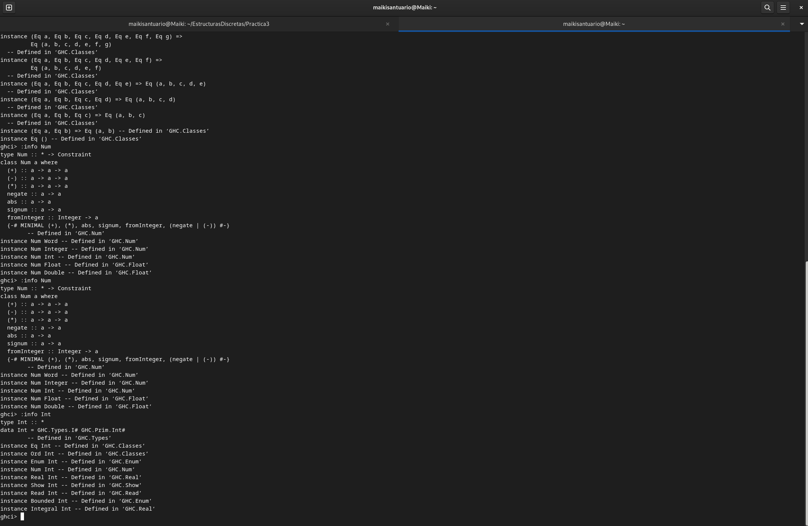

Objetivo: Conocer y aprender el uso de las listas en funciones sencillas. 
Tiempo requerido: Dos horas y media.
Comentarios: De nueva cuenta se me dificulta mucho usar Git y más con los commits semanticos, considero que voy mejorando pero muy lentamente. 
1. ¿Cuál es la diferencia entre Num e Int?
Un Int es un tipo de dato que representa los números enteros, es decir, que almacena a los números enteros positivos y negativos pero no acepta decimales mientras que el tipo Num es una typeclass que engloba a los Int, aqui sí se incluyen los números con decimales, es decir, actúa como un contenedor. 

2. Se necesita producir una lista infinita de todos los pares distintos (x, y) de números naturales. No importa en qué orden se enumeren los pares, siempre que estén todos. Di si la siguiente definición hace su trabajo si crees que no, proporciona tu propia versión y justificala. 
No funciona porque primero toma una x igual a 0 y luego intenta recorrer todos los valores de y que van desde 0 hasta infinito, por esto mismo la función nunca llega al final de y haciendo que la x nunca llegue a cambiar al siguiente valor, es decir, el 1. 
Funciona porque va sumando los valores del par ordenado, haciendo que cuando los valores terminen con la suma de 1, pase al siguiente valor tambien recorre y va recorriendo los valores de x y y, asegurandonos que cada par salga. 
3. Recursión en "El pollito pío".
La canción "El pollito pío" funciona de manera recursiva ya que cada vez que se agrega un animal la secuencia se vuelve a repetir, agregando al animal aunque es un poco diferente porque de ser totalmente recursiva se añadiría el animal al inicio de la canción, es decir, a la cabeza y no a la cola. El caso base sería cuando llega el tractor ya que ahí termina la canción impidiendo a que pase al siguiente elemento. 